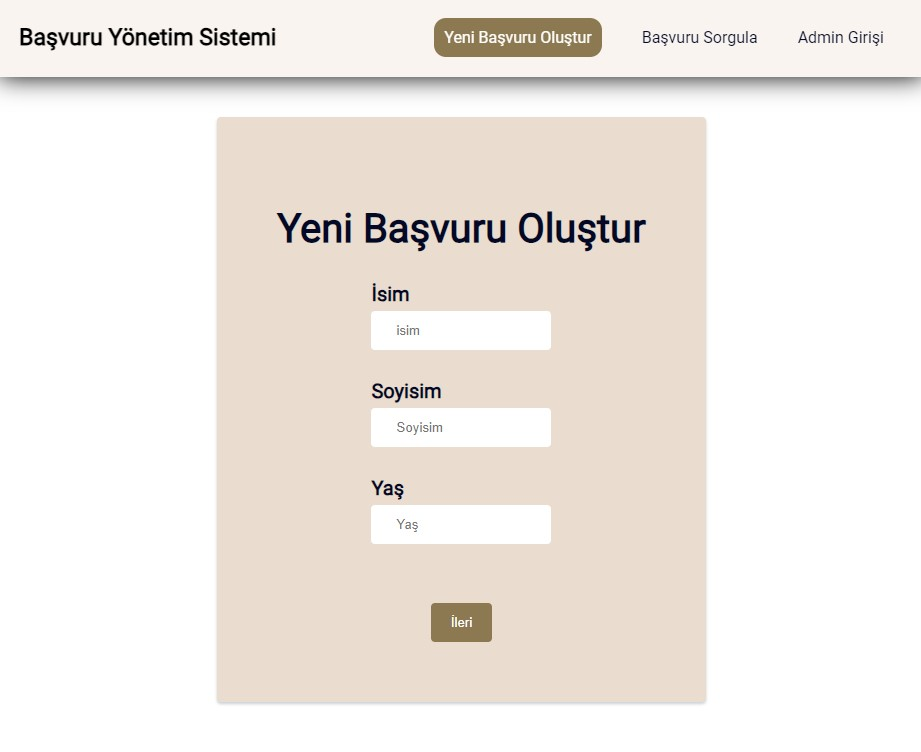

# Fimple React Bootcamp Final Case

[Demo](https://fimple-react-bootcamp-final-case.vercel.app)

# Başvuru/Ticket Yönetim Sistemi

Bu proje, herkese açık bir başvuru formu doldurulmasıyla başlar ve başvuruların yönetimini sağlar. Başvuruların durumunu takip edebilen kullanıcılar ve yetkililer için tasarlanmıştır.

## Kullanılan Teknolojiler

- React Hooks
- Router (react-router)
- Context API
- Form Yönetimi Kütüphanesi (react-hook-form)
- Validasyon Kütüphanesi (yup)
- Eslint

## Proje Detayları

### Başvuru Formu

- Yeni başvuru oluşturmak için `/basvuru-olustur` endpoint'i kullanılır.
- Başvuru formunda Ad, Soyad, Yaş, TC, Başvuru Nedeni, Adres Bilgisi, Fotograflar gibi bilgiler yer alır.

### Başvuru Başarılı Sayfası

- Başvuru formu doldurulduktan sonra yönlendirilen sayfadır.
- Teşekkür mesajı ve başvuru detayları ile birlikte başvuru kodu görüntülenir.

### Başvuru Sorgulama

- Başvuru kodu girilen bir input ile `/basvuru-sorgula` endpoint'inde başvurunun durumu sorgulanabilir.

### Başvuru Detayları

- Başvuru numarası ile `/basvuru/{basvuruNo}` endpoint'i üzerinden başvurunun detayları görüntülenebilir.

### Admin Paneli

- `/admin` endpoint'i üzerinden kullanıcı girişi yapılabilir (u:kodluyoruz, p:bootcamp109).
- Başarılı giriş sonrasında `/admin/basvuru-listesi` endpoint'inde bekleyen başvuruların listesi görüntülenebilir.
- Her başvuruda başvuruyu düzenle butonu vardır.
- `/admin/basvuru/{basvuruNo}` endpoint'i üzerinden başvurunun durumu güncellenebilir ve cevap yazılabilir.

## Nasıl Çalıştırılır?

1. Proje dosyalarını bilgisayarınıza kopyalayın.
2. Terminal veya komut istemcisinde proje dizinine gidin.
3. `npm install` veya `yarn install` komutu ile bağımlılıkları yükleyin.
4. `npm start` veya `yarn start` komutu ile projeyi başlatın.

## Lisans

Bu proje açık kaynaklıdır ve MIT lisansı altında lisanslanmıştır. Detaylar için [LICENSE](LICENSE) dosyasını inceleyebilirsiniz.

## İletişim

Proje ile ilgili sorularınız veya geri bildirimleriniz için [anılaltan](mailto:anlaltnn@gmail.com) adresi üzerinden iletişime geçebilirsiniz.
